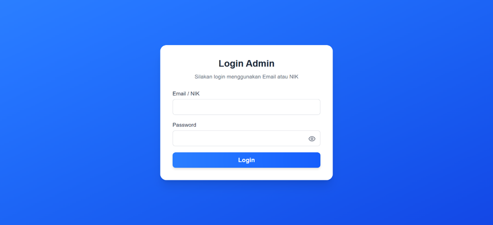
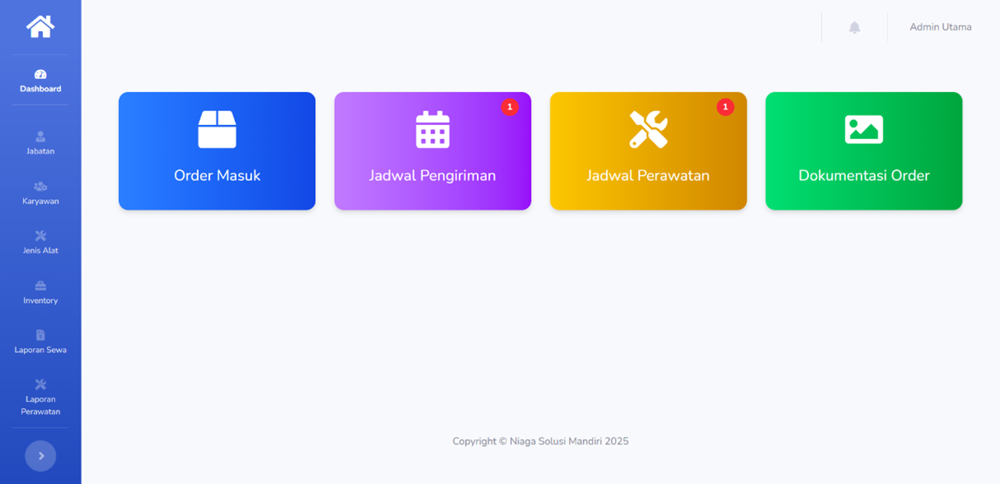
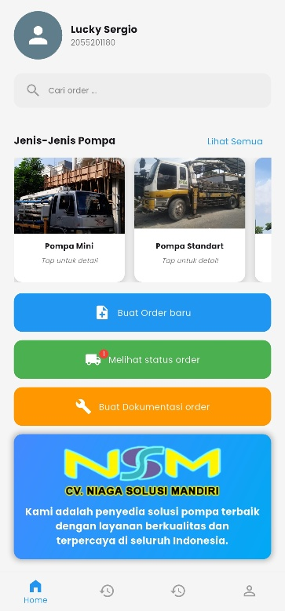
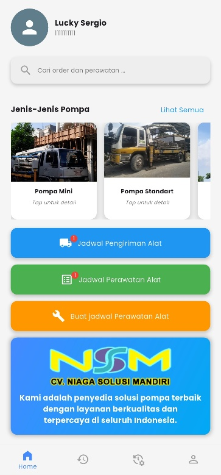
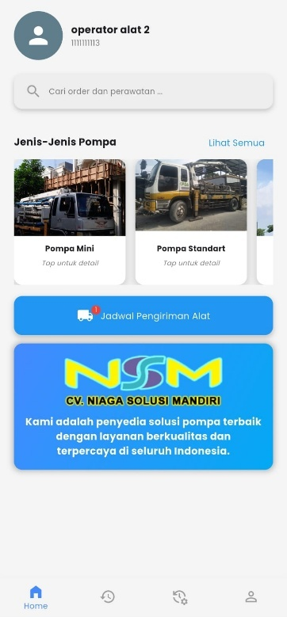
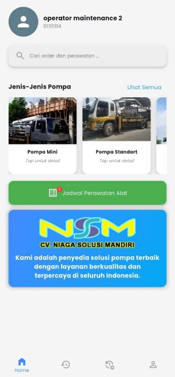

# 📦 Project NSM

**Project NSM** adalah sistem informasi manajemen **berbasis web dan mobile** yang dirancang untuk membantu operasional CV. **Niaga Solusi Mandiri** dalam penyewaan alat dan layanan. Sistem ini memungkinkan kolaborasi real-time antara **Sales**, **Admin**, dan **Penanggung Jawab Alat**, mulai dari pencatatan order hingga proses perawatan alat.
### Web: Login & Admin

<p align="center">
  
  
</p>

---

### Mobile: Sales, Penanggung Jawab, Operator Alat, Operator Maintenance

<p align="center">
  
  
  
  
</p>
---

## ✨ Fitur Utama

- ✅ Pembuatan dan pengelolaan order sewa alat  
- 📦 Manajemen inventori alat secara real-time  
- 📱 Aplikasi mobile untuk sales & penanggung jawab alat  
- 🖼️ Upload dokumentasi order (foto dan video)  
- 🛠️ Penjadwalan & pemrosesan perawatan alat  
- 🔔 Notifikasi otomatis (opsional via Firebase Cloud Messaging)  
- 📊 Rekap laporan dan histori order  

---

## 👥 Modul & Akses Pengguna

### 🧑‍💼 Sales (Mobile App - Flutter)
- Melihat data alat yang tersedia  
- Membuat order sewa  
- Upload dokumentasi lapangan (foto/video)  
- Melihat status dan histori order  

### 🧑‍💻 Admin (Web App - Laravel + Bootstrap)
- Kelola data inventori  
- Proses order dari sales  
- Melihat histori dan rekap order untuk laporan manajemen  

### 🛠️ Penanggung Jawab Alat (Mobile App - Flutter)
- Melihat daftar order yang perlu diproses  
- Menjadwalkan dan mengeksekusi perawatan alat  
- Update status perawatan dan catatan teknis  

---

## 🧰 Teknologi yang Digunakan

| Komponen             | Teknologi                          |
|----------------------|-------------------------------------|
| Backend API          | Laravel 12                          |
| Web Admin Dashboard  | Blade Template + Bootstrap 5        |
| Mobile Apps          | Flutter (Sales & Penanggung Jawab) |
| Basis Data           | MySQL                               |
| Media Storage        | Local Storage (opsional: Firebase)  |

---

## 📁 Struktur Direktori

```
projectnsm/
├── app/                     # Logic backend Laravel
├── public/                  # Aset publik
├── resources/               # Blade template & assets
├── routes/                  # Web dan API routing
├── mobile_sales/            # Flutter app untuk sales
├── mobile_penanggung/       # Flutter app untuk penanggung jawab alat
└── README.md
```

---

## ⚙️ Instalasi

### 🔧 Backend Laravel

```bash
git clone https://github.com/luckysergio/projectnsm.git
cd projectnsm
composer install
cp .env.example .env
php artisan key:generate
php artisan migrate
php artisan serve
```

### 📱 Mobile App (Sales & Penanggung Jawab)

```bash
# Untuk aplikasi Sales
cd mobile_sales
flutter pub get
flutter run

# Untuk aplikasi Penanggung Jawab Alat
cd mobile_penanggung
flutter pub get
flutter run
```

---

## 📬 Kontak

Ingin bertanya atau berdiskusi lebih lanjut?  
Silakan hubungi saya melalui:

- 📧 Email: luckysergio77@gmail.com  
- 📷 Instagram: [@lcksr](https://instagram.com/lcksr)  
- 💬 Telegram: [@iLcksr](https://t.me/iLcksr)

---

## 📝 Lisensi

Proyek ini dikembangkan untuk keperluan internal **CV. Niaga Solusi Mandiri**.  
Tidak diperkenankan untuk disebarluaskan atau digunakan secara komersial tanpa izin tertulis dari pengembang.

---

> Dibuat oleh **Lucky Sergio**
